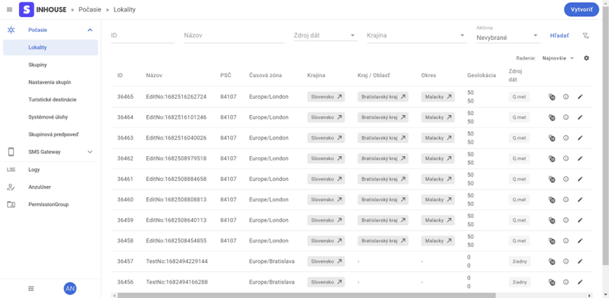

# Layout

## Toolbar

- mostly one line (some exceptions can use more)
- always visible, sticky
- consist of 3 parts:
  - burger menu show/hide
  - breadcrumbs
  - action buttons

### Breadcrumbs

- first part is a logo
- all items must have link to specific view, except last item
- breadcrumbs will mostly have 3 levels like this: 
  - `logo > entity list > entity detail/create/edit`
- in some specific situation 4th level can be used, in multi system admins even 5 levels can be used

## Sidebar

- 3 modes:
  - hidden
  - full
  - compact
- on desktop, sidebar is fully visible with full text, using burger menu in Toolbar, sidebar switch to compact mode where only icons are visible
- compact mode can contain different items than full version
- on mobile, the burger icon in Toolbar switch between full and hidden only
- items in sidebar can be grouped to groups, specially when admin is multi system
- bottom part of sidebar contains admin switcher and user dropdown menu

#### Admin switcher
- optional
- UX to quick switch between corporate admins
- can be configured using json file

#### User dropdown
- contains user info:
  - avatar text and color, user info
- link to settings where you can change theme and language
- logout link

## Content

See [views](../views/)
